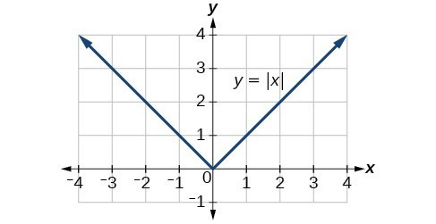
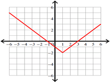

# Transforming Absolute Value Functions
## The Parent Function
Equation: f(x) = |x|

## Generic Equation
f(x) = a |x - h| + k

Reflect(-a)     Right(-h)       Up(+k)

Stretch(a>1)    Left(+h)        Down(-k)

Compress(a<1)  
## Example
f(x) = |x - 1| - 2

